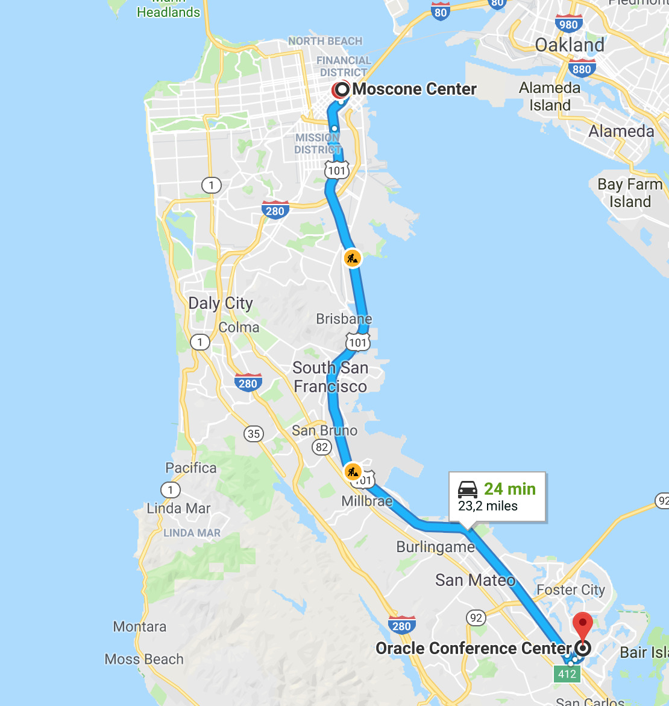
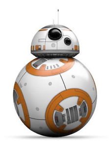
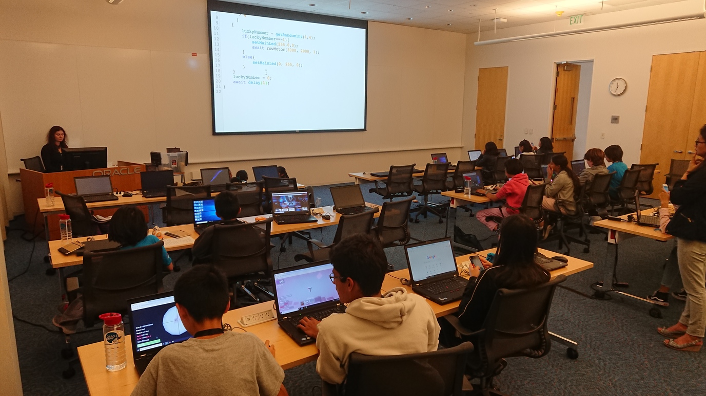
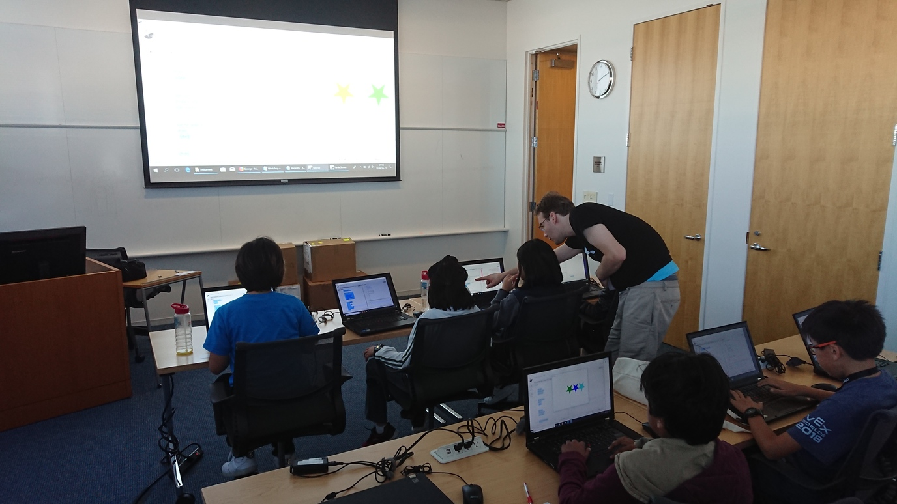

Code4Kids je akce spojená s původní JavaOne. Loni na JavaOne, Oracle sháněl dobrovolníky na akci pro děti, jelikož měl spoustu dětí a málo lidí. Loni jsem se přihlásil a mimo to, že to byla sranda, tak se člověk setkal se spoustou lidí s oceněním Java Champion. Letos jsem s touto akcí od začátku počítal, ale ne, a ne najít o ní zmínku na stránkách konference. Nakonec jsem napsal loňské pořadatelce, která mě nasměrovala na aktuální pořadatelku. Ta mi poskytla link pro registraci dobrovolníků s upozorněním, že se akce nekoná jako loni v centru San Francisca, ale na centrále Oracle v Redwoo City. Po chvilce váhání, jsem se přihlásil, jelikož jsem ve městě už stejně byl, tak co bych jinýho dělal.

Letos akce nebyla tak megalomanská, loni 200 dětí ve třídě, letos to bylo spíš pro místí a ve třídách bylo cca 30 dětí což je příjemnější počet. Jako první zádrhel se ukázala lokalita. Redwood City možná místní rodičům víc vyhovovalo, co se týče dopravy, pro nás ostatní to taková sranda nebyla. Někteří se skřípěním zubů zaplatili 50 USD za Uber, já jsem si udělal cvičení s americkou hromadnou dopravou (v USA hromadnou dopravu prakticky nikdo nepoužívá a podle toho to vypadá). Způsobů, jak se z Downtownu SF dostat do Redwood City je několik, nicméně v neděli brzy ráno to taková sláva není.

První jsem zkusil Google je tam přece možnost pro MHD. Google řekl, že dřív jak v pondělí se tam nedostanu. Váhal jsem, jestli mi to stojí za to, nakonec jsem se rozhodl, že zkusím hledat víc a pokud to nedopadne tak to lámat přes koleno nebudu. Našel jsem příměstský vlak Calltrain, to by bylo dobrý, bohužel o víkendu probíhá údržba a nejezdí. Druhá možnost Muni (Municipal transport) tam žádný uspokojivý spojení nebylo. Začal jsem se dívat na pronájem skútru nebo e-biku, ale to v čase kolem 7:00 v neděli byla utopie. Nakonec jsem našel autobusy SamTrans, ty už měli lepší spojení a dokonce i správným směrem s cenou 4 USD. Stačilo 15 minut v Downtownu dojít na zastávku, strávit hodinu v autobusu a pak půl hodiny dojít na místo určení. Pro běžného Amíka asi neakceptovatelná varianta, jinak by to přece Google nabízel.

Samotný hodiny byly zábavný a poučný i pro mě. Jelikož nikdo neposlal žádný materiály dopředu, tak cílem mě jako asistenta bylo pochopit to rychleji než děti a pomoct jim. No není to tak snadný, ty děti nejsou blbý, takže u těch rychlejších jsem se přiučil a těm pomalejším jsem pak pomohl.

První moje hodina byla *"Playing Programming with Kids and a Robot"* s [Olexandrou Dmytrenko](https://twitter.com/LadyInIT). Nikdy jsem nic takovýho nedělal a vůbec jsem netušil, jak se to dělá. Používali jsme roboty "Sphero BB-8 Star Wars". Cílem bylo naprogramovat "Lucky Ball". To znamená, že si děti v kroužku hází tou robo-kuličkou a po každým chycení se robot rozsvítí zeleně nebo červeně a podle toho daný dítě pokračuje ve hře nebo vypadává. K tomu všemu nějaký vibrování a zvuky. Celkem ambiciózní plán, programovalo se v JavaScriptu na telefonu, který přes Bluetooth komunikoval z tím robotem. Přes spoustu problémů s tím, že se robot nechtěl spojit nebo se spojil s telefonem někoho jinýho atd. to aspoň některý děti stihly a já jsem si to užil a klidně bych si na hraní domů nějakýho pořídil.

Druhá hodina byla *"Game Development with George"* s [Victorem Duranem](https://twitter.com/hiqinternat). Tady jsem si procvičil programovací jazyk Clojure. Sice jsem v něm nikdy neprogramoval, ale to už bylo na tolik podobný programování, na jaký jsem zvyklý a děti jsem porážel. Nicméně mi lektor říkal, že jednou měl skupinu, která byla lepší než on a že to bylo peklo. Toto si prý taky užil, protože tyhle děti nebyli tak našláplý :-)

