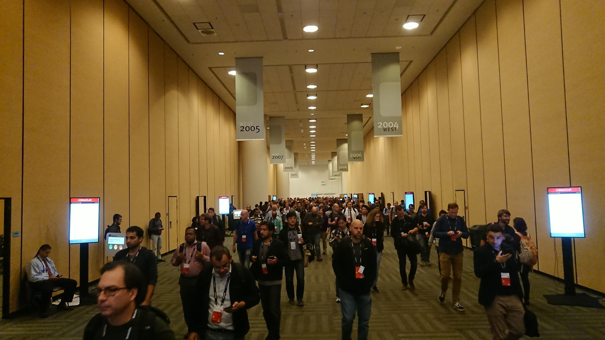
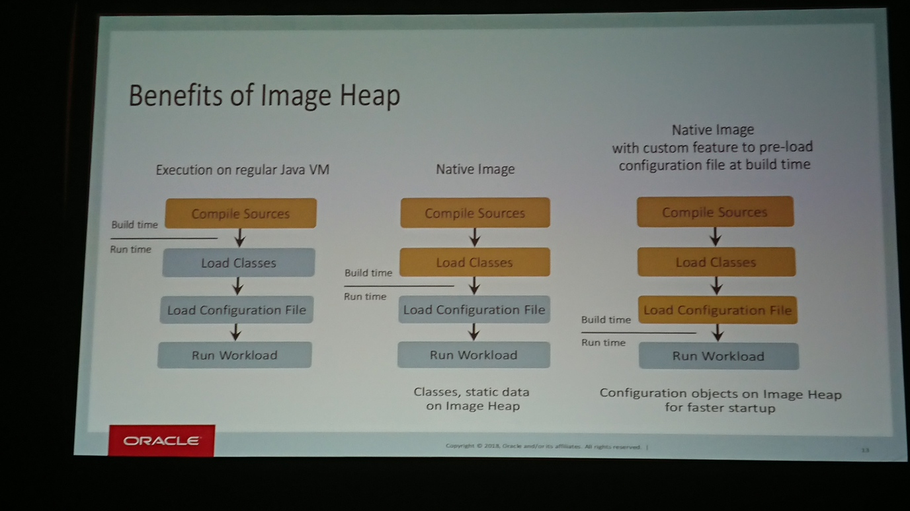
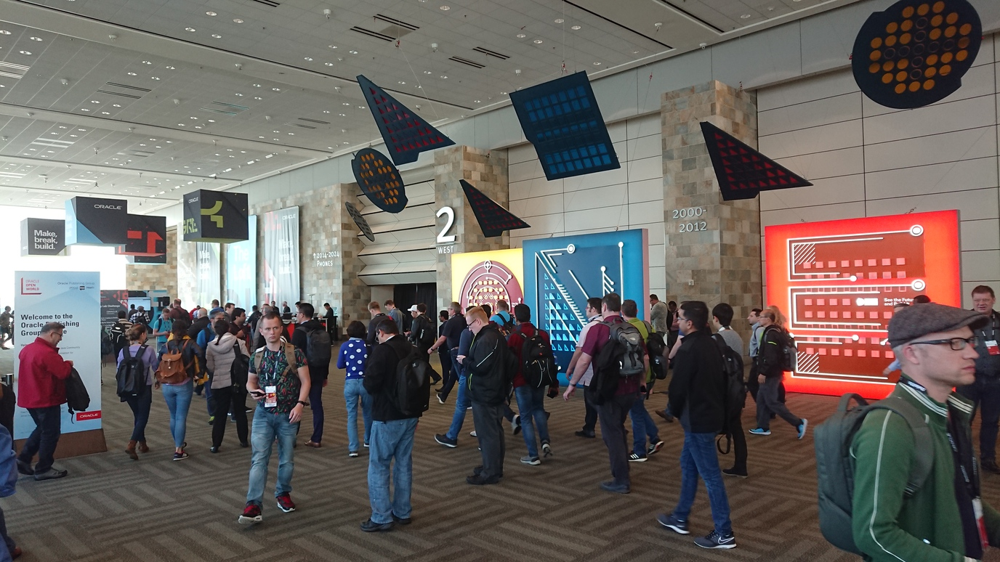
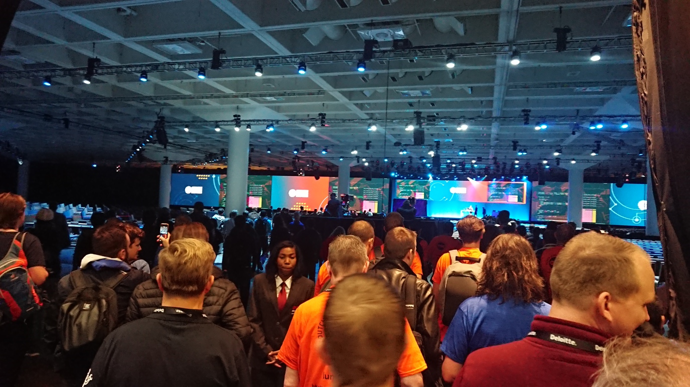
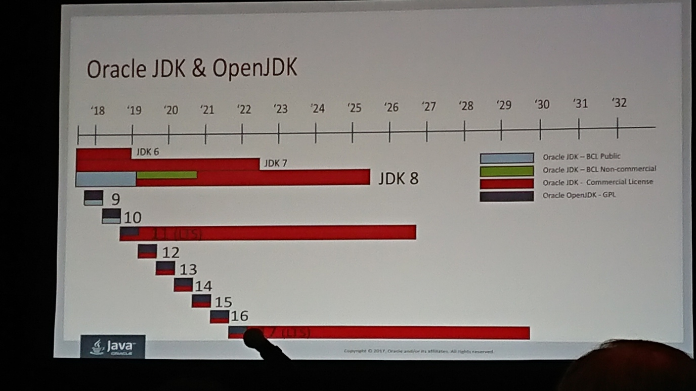
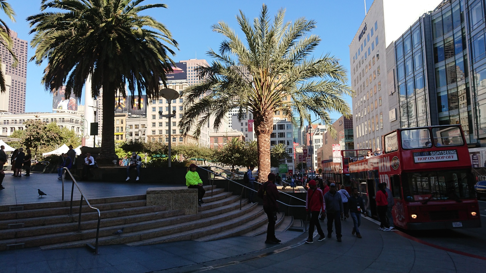
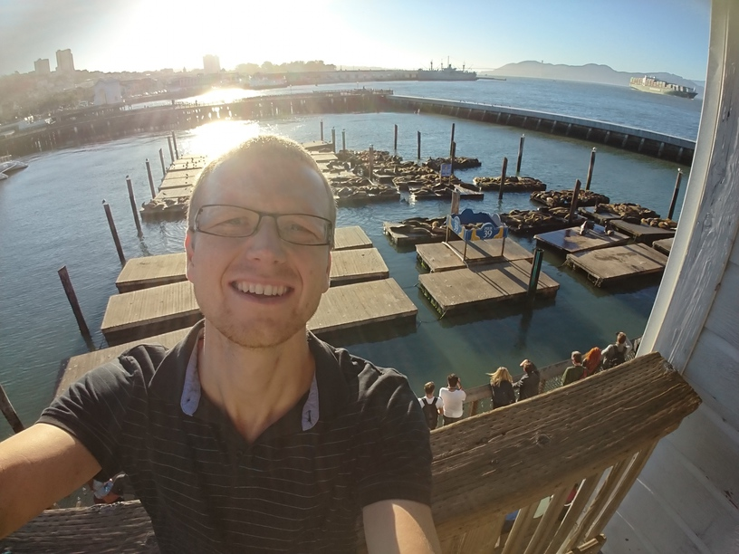

Před týdnem jsem se vrátil Oracle Code One konference, i když v mém srdci je to stále JavaOne. Moc tuzemských vývojářů na tuto konferenci nejezdí, proto jsem se rozhodl sepsat svoje dojmy a zážitky. Třeba to někomu pomůže, příště na konferenci také jet.

Zvláštností konference je, že místo na každé přednášce si musíte předem rezervovat. Přednášky probíhají až ve dvaceti sálech najednou a všechny sály jsou zhruba stejně veliké (200 - 250 míst k sezení). Proto je dobré sledovat stránky konference zhruba měsíc dopředu a zarezervovat si místo na těch co Vás zajímají. Letos se konalo něco přes 600 přednášek za 4 dny, takže je z čeho vybírat.

Poučen z konferencí, které jsem již navštívil, jsem vybíral primárně podle speakera. Moji oblíbenci jsou Venkat Subramaniam, Adam Bien, Sebastian Daschner, Arun Gupta, Reza Rahman, Bruno Souza atd. Moje nejoblíbenější témata pak jsou Java nebo Jakarta EE, MicroProfile, Kubernetes, Event Sourcing. Vždycky nebude vybírat jenom ze svých top přednášek a přednášejících. V kroku dva jsem si dával primárně pozor, abych neskončil na marketingové přednášce tzn. pokud všichni přednášející byli z firmy Oracle a v popisu přednášky se vyskytovalo klíčové slovo OracleCloud tak to byl pro mě signál se přednášce vyhýbat. Jakmile máte přednášku rezervovanou, musíte se na ni dostavit nejpozději 5 minut před začátkem, pak už je sál doplněn kýmkoliv, kdo přijde.

## Moudra od přednášejících
Za ty čtyři dny toho bylo spoustu, zkusím vybrat to nej a ještě občas k tomu přidám svůj komentář

**Sebastian Daschner** - Seven Principles of Productive Software Developers

* **embrace automation** - pište si skripty na cokoliv co děláte víc než dvakrát, používejte aliasy v terminálu, používejte **zsh** (nemusíš psát cd, nemusíš psát přesnou cestu, ale jenom první písmena cesty pokud jsou unikátní), se vším pracujte jako se zdrojovým kódem (document as code, Jenkinsfile, Dockerfile, kubernetes yaml)
* **eliminate context switches** - nepracujte na vícero věcech najednou
* **step back and reflect** - jde o to se občas zastavit a zamyslet na tím, co vlastně dělám a zda neexistuje efektivnější cesta
* **don't make me think (twice)** - vše co děláte tak dokumentujte, pište si seznam úkolů ať na ně nemusíte myslet
* **know your craft** - čtěte dokumentaci, naučte se to co děláte, abyste to dělali co nejefektivněji (načte se svůj programovací jazyk, svoje IDE atd.)
* **communicate** - sdílejte znalosti s kolegama, pište blog, prezentujte na konferencích atd.
* **relax** - odpočívejte a užívejte si ten volný čas jinak nemá význam pracovat efektivněji

Já osobně s většinou toho souhlasím, ale rady jako přepnout telefon do flight modu a mít skvělou klávesnici, mně osobně nepřijdou jako nejdůležitější. Výsledek naší práce je vytvořen týmovou spoluprací a často ostatním se líp pracuje, pokud můžou komunikovat s Vámi a stejně tak i Vám. Samozřejmě to musí být v rozumné míře, ale málokdo z nás je samotný voják ve válce a je potřeba mít zastupitelnost a sdílené know-how.

**Randall Degges** - Stop Using JSON Web Tokens

Randall doporučuje používat cookies místo JWT protože:
* JWT nikdo nekryptuje
* za poslední dva roky měla většina knihoven zavažný security issues
* JWT sice není náchylný na CSRF, ale to se jednodušeji brání než XSS (dneska si do projektu přidáváme stovky knihoven, které mají přístup k Vaší local storage a můžou s ní dělat cokoliv)
* výhoda JWT je že při ověřování identity nemusí do DB, nicméně pokud chceš podporovat logout (tzn. invalidaci token před jeho expirací) tak musíš do DB stejně tak
* mrkněte na [Paseto](https://paseto.io/)

**Oleg Selajev** - GraalVM: Vision and Roadmap

Podrobnější seznámení s GraalVM, ze kterého jsem byl díky jedné z předchozích přednášek nadšený. Oleg mi trochu rozbořil můj pohled.

Už jsem se viděl, jak vytvářím skvělé Native Image, které budou rychle startovat, budou mixovat Javu, JavaScript a C a poběží na všech platformách. Bohužel rychlost startu má význam, pokud celý program má běžet vteřinu, pokud je to něco co běží minuty, hodiny, dny a nedej bože třeba měsíce, tak nějaký desetinky nebo vteřina na startu není zas tak významná. Tu binárku (Native Image), který vytvoříte znovu spustíte pouze na platformě, na které jste to buildili. To dá rozum i Java má samostatný installer pro různý platformy a kdyby to šlo bez toho tak by to už dávno udělali. A potom ten samotný build není zas taková procházka růžovým sadem. Plno knihoven používá dynamický class loading a to musíte pro GraalVM specifikovat ručně.

Za mě z toho vychází, podívat se na to trochu blíž, ale zatím na tom nepálit moc času. Význam pro mě jako takový úplně nevidím.

**Aurelio Garcia-Ribeyro** - The Future of Java SE

Představoval nový release model pro Java SE a k tomu vypíchl pár užitečných tool a novinek, které se chystají pro další verze Javy.
* **[jdeprscan](https://docs.oracle.com/javase/9/tools/jdeprscan.htm)** - proskenuje Vaše zdrojové kódy a je schopný upozornit a na využívání deprecated věcí
* **[Portola Project](https://openjdk.java.net/projects/portola/)** - Java pro Alpine Linux
* **[Valhalla](https://openjdk.java.net/projects/valhalla/)** - Value Types pro Javu (možnost předávat objekty hodnotou)
* **[Project Panama](http://openjdk.java.net/projects/panama/)** - lepší volání nativní funkcí
* **[Loom](http://openjdk.java.net/projects/loom/)** - lightweight threads neboli Fibers, nové vlákno v Javě nebude nutně nový proces v systému
* **[Project Amber](http://openjdk.java.net/projects/amber/)** - Raw String Literals (víceřádkový stringy) a vylepšený switch s vyhodnocováním
* **[Skara](http://openjdk.java.net/projects/skara/)** - snaha dostat zdrojové kódy OpenJDK z Mercurialu do Gitu

## Jaký přínos měla tato konference pro mě?
Samotná akce, je obrovská svým rozsahem a přínosem je v několika rovinách.

Nejdůležitějším aspektem je podle mě, že se člověk na pár dní odpoutá ze své každodenní rutiny a má čas a příležitost zamyslet se. Zamyslet se nad způsobem jakým sám funguje, jakým procesem software vyvíjí a jaké technologie používá při vývoji. Myslím, že tato aktivita je občas podceňovaná a pak *"pro stromy není vidět les"*.

Druhou věc je networking tzn. setkávání se s lidmi. S lidmi, kteří jsou stejně jako Vy vývojáři, ale díky velikosti této akce, je zde většina top lidí z oblasti. Chápu, že pro nás vývojáře je to občas složité a sociální dovednosti nejsou ten náš nejcennější skill. U mě je to stejný, jsem nespolečenský introvert, který si vystačí sám. Nicméně jsem poznal, že tam venku, mimo moji komfortní zónu, je toho víc, než dost co mě může obohatit a proto se snažím překonat sám sebe a využít té příležitosti. Šťastnou náhodou, pak třeba potkáte člověka, co zná Vaši open-source knihovnu a řekne Vám k ní Váš názor. Případně se zapojíte do diskuze s osobnostmi jako Reza Rahman, Sebastian Daschner, Simon Maple, Trisha Gee a další. I když jste pravděpodobně nejhloupější u stolu je dobré této příležitosti využít a zaměstnat ty chytré mozky Vašimi problémy (o tom jaká byla párty si můžou povídat cestou na letiště). Ti lidi tam přijeli, aby se mohli setkávat s ostatními. Chápou, že to obohacuje i je samé, nikoho to neobtěžuje a je to podle mě to nej na celé konferenci.

Díky této konferenci, jsem snad doopravdy založil svůj blog, což je mnou několikrát nakousnutá a několikrát odložená aktivita. Přemýšlím, že se minimálně připojím na některé meetingy k MicroProfilu. Rozhodl jsem se, přepnout na zsh. A výhledově bych si chtěl vyzkoušet service mesh Istio.

