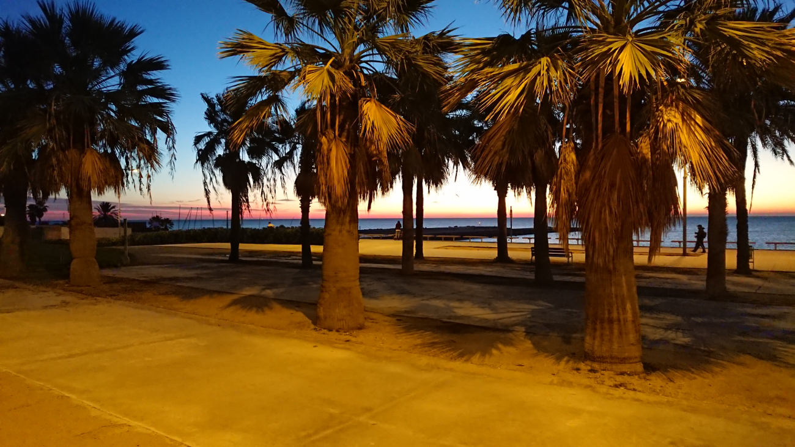
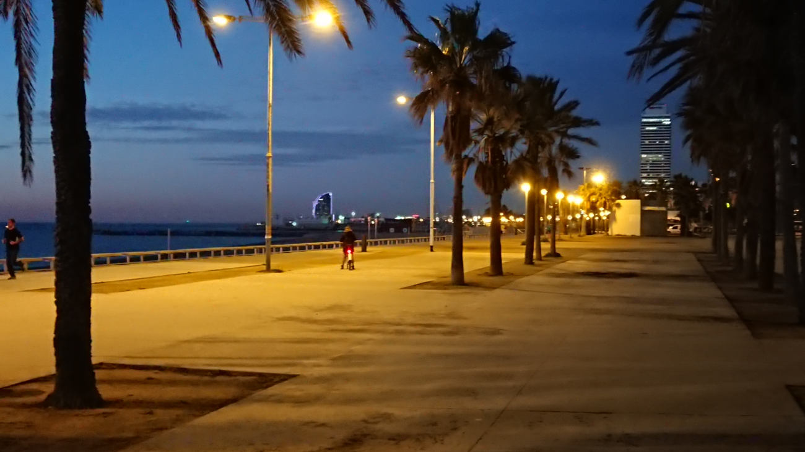
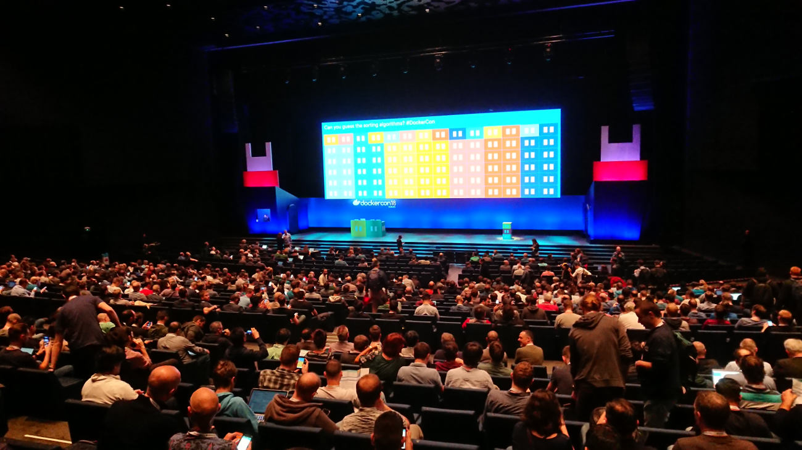
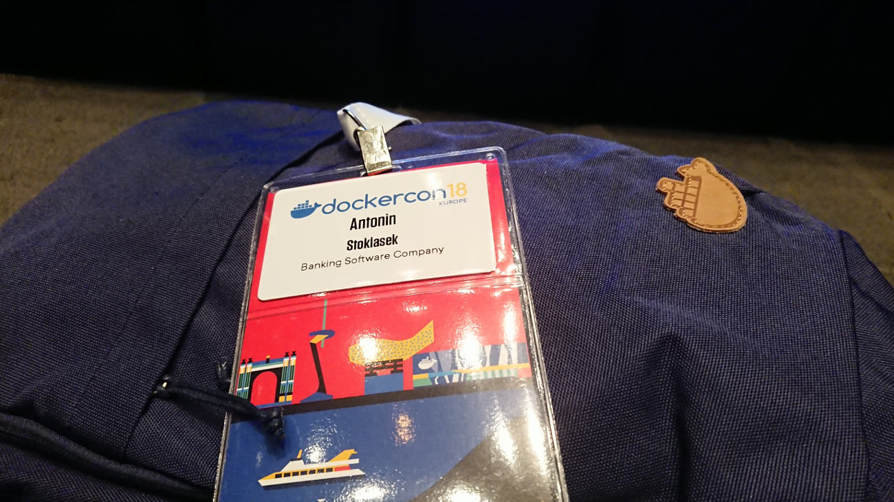
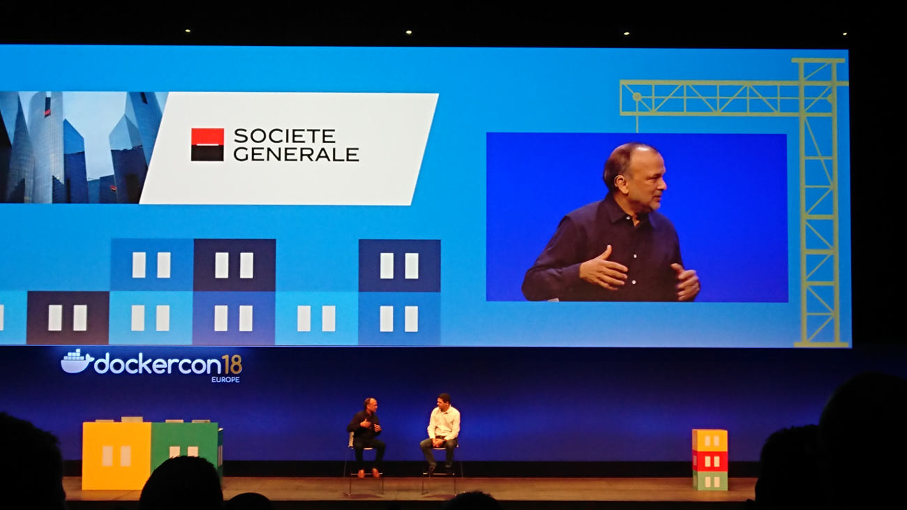
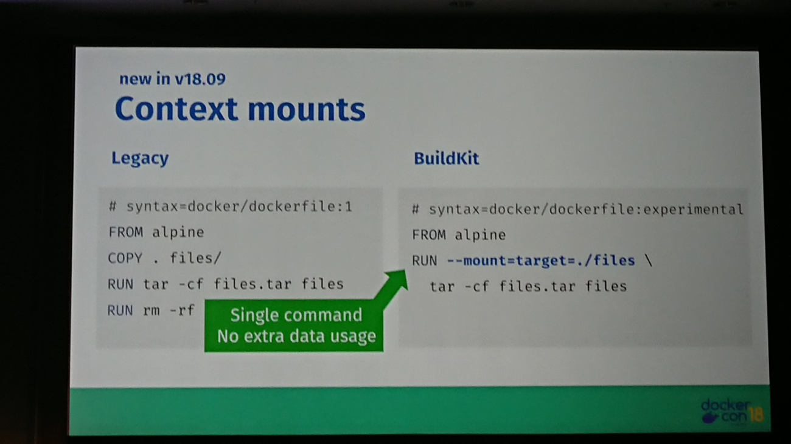

Nejlépe zorganizované konference, má letos stejně jako minulý rok Docker. DockerCon v Barceloně to jen potvrzuje. Nikde jinde neorganizují setkání pro nováčky (Docker Pals), program pro partnery a partnerky (Spousetivities) a organizované setkávání mezi účastníky (Hallway Track). Nováčkem se býti necítím, takže Docker Pals jsem se neúčastnil a přece jenom je to můj teprve druhý DockerCon a tudíž na průvodce to taky nevídím. Průvodcema bývají obvykle účastnící, kteří mají čtyři a více účastí. Loni se mi věnoval Tibor Vass, letos už to zvládám sám. Se Spousetivities zkušenost nemám, manželka se rozhodla se mnou do Barcelony necestovat, třeba některý z další DockerConů.

Hallway Track je, ale jiná písnička. Všichni účastníci jsou vyzvání, aby napsali pár řádek o tom, co by chtěli diskutovat s ostatními. Formát diskuze 1-1 mi maximálně vyhovuje, tudíž jsem nabídl k diskuzi téma "CI/CD with integration tests". Zájem, byl větší, než jsem schopný zvládnout. Vyplnil jsem dizkuzemi veškerý čas, co jsem na konferenci a nejsem zrovna na některé z přednášek, a ještě zhruba stejný počet jsem musel odmítnout. V číslech je to pak cca 12 setkání realizováno a 10 odmítnuto, protože prostě nebylo už kdy. V integračních testech se toho zas tolik vymyslet nedá, ta myšlenka je jasná a realizace víceméně podobná. Obvykle jsme probrali náš a jejich setup, jak technologický, tak přístup integračním testům. Někoho víc zajímali, jiné podrobnosti z projektu, jako Bitrise a celý čas jsme věnovali tomu. Největší úspěch z našeho testování zaznamenal náš DataImportTool nikdo nic takovýho nemá a všem se ta myšlenka líbila. Možná bych mu mohl věnovat, celý článek.

Mám dojem, že se několikrát za den dozvím pecku. Novou technologii, která by se mi hodila, případně přístup, který mě předtím nenapadl. Nevím, jestli je to tím, že moje znalosti na poli kontejnerů jsou tak chabé, nebo se to odvětví tak rychle vyvíjí. Snažím se to uhrát na remízu, že to je obojí. Když mi ale popisoval [Jeff Nickoloff](https://twitter.com/allingeek) jak přes Kubernetes, pomocí **[Kubernetes Operators](https://coreos.com/operators/)**, řídí zdroje na AWS, ovládá Jenkins nebo jen posílá zprávy, tak jsem téměř oněměl jak je to dokonalý. Teď už jenom, aby to fungovalo tak jak popisoval.

Další věci, co mě zaujali (i když to není taková pecka)

* [Open Policy Agent](https://www.openpolicyagent.org/) - práce s policies
* [Docker App](https://github.com/docker/app) - packaging aplikací z více kontejnery
* [Distroless Images](https://github.com/GoogleContainerTools/distroless) - Alpine image druhé generace
* [BuildKit](https://github.com/moby/buildkit) - pokročilé buildy docker images
* [Telepresence](https://www.telepresence.io/) - local development s Kubernetes
* [Rancher](https://rancher.com/) - Správa a Support pro Kuberntes cluster

Bezpečnostní vychytávky od [Aqua Security](https://www.aquasec.com/):

* [MicroScanner](https://github.com/aquasecurity/microscanner) - pro controlu bezpečnostních rizik Vašich imagů
* [KubeBench](https://github.com/aquasecurity/kube-bench) - pro kontrolu správného nastavení kubernetes node
* [KubeHunter](https://github.com/aquasecurity/kube-hunter) - na penetrační test kubernetes clusteru

Je toho více než dost. Brzo musím najít čas a podívat se na to podrobněji. Určitě, to všechno nebude taková sláva, jak to na první pohled vypadá, ale kdyby aspoň polovina.

