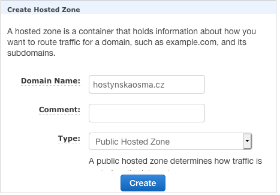
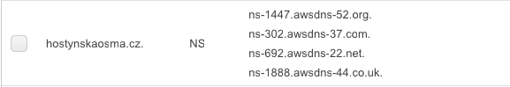
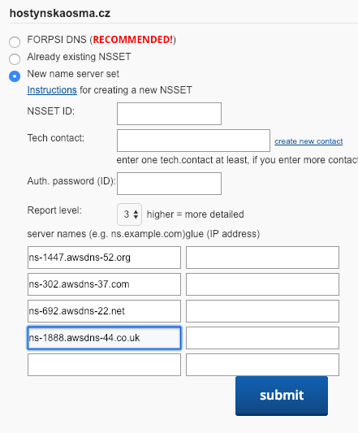
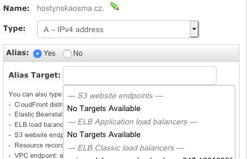

Ingress is designed for fast setup of routing rules. Prior ingress I used NGINX reverse proxy service exposed as LoadBalancer but every change to routing requires change in config file and restart of the service. More and more services were deployed to my Kubernetes cluster and NGINX configuration gets bigger, not so simle and harder to maintain. I've decided to go for Ingress.

There are several issues I solved on my way:

* Define ingress rules
* Install Ingress controller
* Redirect to SSL
* SSL with `.crt` and `.key` file
* SSL with Let's Encrypt
* Redirect naked (non-www) domain to www domain
* DNS A record for AWS ELB
* Expose Traefik Dashboard UI
* Authorization for service exposed by ingress rule
* Monitor Ingress controller by exposing Prometheus metrics

First you need to define **Ingress rules**. There is [Ingress](https://kubernetes.io/docs/concepts/services-networking/ingress/) documentation and everything is straight forward.
```yaml
apiVersion: extensions/v1beta1
kind: Ingress
metadata:
  name: tomcat-ingress
spec:
  rules:
  - host: www.hostynskaosma.cz
    http:
      paths:
      - backend:
          serviceName: tomcat
          servicePort: 8080
```

Define **ingress rules will NOT make routing work** out of the box. Kubernetes does not provide any default **ingress controller** and you have to pick and install one by yourself.
My first choice was NGINX because prior installing ingress I was using NGINX server as a reverse proxy anyway. I started with [NGINX Ingress Controller](https://github.com/nginxinc/kubernetes-ingress). There is wide range of configuration possibilities, but I am no an expert in NGINX configuration and it was too difficult for me. Google can help with everything but there are three NGINX Ingress Controllers (kubernetes/ingress-nginx, nginxinc/kubernetes-ingress with NGINX, nginxinc/kubernetes-ingress with NGINX Plus) and sometimes the found solution is just not right for you. I wanted to setup redirect of naked domain to www domain which should be done location or server snippets and I was not able to make it work. I started to question my choice of NGINX and I remembered someone at a conference praising [Traefik](https://traefik.io/) I checked DockerHub and Traefik Official Image 10M+ downloads vs. NGINX Ingress Controller 500K+ downloads. I decided to give it a try.

Since my cluster already worked somehow with NGINX ingress controller, I added annotation
```yaml
annotations:
  kubernetes.io/ingress.class: nginx
```
to my old ingress rules. I installed second ingress controller (Traefik) to my cluster and I can explore its features and routing single test service to Traefik using annotation
```yaml
annotations:
  kubernetes.io/ingress.class: traefik
```

**Traefik installation** is simple. The documentation is clear and very helpful [https://docs.traefik.io/user-guide/kubernetes/](https://docs.traefik.io/user-guide/kubernetes/).

1. Install RBAC [traefik-rbac.yaml](https://github.com/containous/traefik/tree/master/examples/k8s/traefik-rbac.yaml)
2. Setup Service expose as Load Balancer (I have tried NodePort described in Traefik documentation, but it does not work for my cluster in AWS)
    ```yaml
    kind: Service
    apiVersion: v1
    metadata:
      name: traefik-ingress
      namespace: kube-system
    spec:
      type: LoadBalancer
      selector:
        k8s-app: traefik-ingress-lb
      ports:
        - name: http
          port: 80
          targetPort: 80
          protocol: TCP
        - name: https
          port: 443
          targetPort: 443
          protocol: TCP
    ```
3. Setup Deployment with ServiceAccount
    ```yaml
    ---
    apiVersion: v1
    kind: ServiceAccount
    metadata:
      name: traefik-ingress-controller
      namespace: kube-system
    ---
    kind: Deployment
    apiVersion: extensions/v1beta1
    metadata:
      name: traefik-ingress-controller
      namespace: kube-system
      labels:
        k8s-app: traefik-ingress-lb
    spec:
      replicas: 1
      selector:
        matchLabels:
          k8s-app: traefik-ingress-lb
      template:
        metadata:
          labels:
            k8s-app: traefik-ingress-lb
            name: traefik-ingress-lb
        spec:
          serviceAccountName: traefik-ingress-controller
          terminationGracePeriodSeconds: 60
          containers:
          - image: traefik
            name: traefik-ingress-lb
            ports:
            - name: http
              containerPort: 80
            - name: admin
              containerPort: 8080
            args:
            - --api
            - --kubernetes
            - --logLevel=INFO
    ```

**Redirect to SSL** is done via annotation.
```yaml
annotations:
  ingress.kubernetes.io/ssl-redirect: "true"
```

Now default Traefik SSL certificate is used. Since I already had my SSL certificate. I need to make **Traefik use my certificate**.
* I transformed `.crt` and `.key` file to Kubernetes Secret
    ```bash
    cat mydomain.com.key | base64
    cat mydomain.com.crt | base64
    ```
    ```yaml
    apiVersion: v1
    kind: Secret
    metadata:
      name: h8-secret
      namespace: h8
    type: Opaque
    data:
      tls.crt: LS0tLS1CRUdJTiBDRVJUSUZJQ0FURS0tLS0tCk1JSURERENDQWZRQ0NRQ2JmTzRzeHZSbkVUQU5CZ2txaGtpRzl3MEJBUXNGQURCSU1Rc3dDUVlEVlFRR0V3SkQKV2pFUU1BNEdBMVVFQnd3SFQyeHZiVzkxWXpFUU1BNEdBMVVFQ2d3SFQzTnZiV0ZvWlRFVk1CTUdBMVVFQXd3TQpiWGxrYjIxaGFXNHVZMjl0TUI0WERURTVNREV3TVRFeE5UazBNMW9YRFRJd01ERXdNVEV4TlRrME0xb3dTREVMCk1Ba0dBMVVFQmhNQ1Exb3hFREFPQmdOVkJBY01CMDlzYjIxdmRXTXhFREFPQmdOVkJBb01CMDl6YjIxaGFHVXgKRlRBVEJnTlZCQU1NREcxNVpHOXRZV2x1TG1OdmJUQ0NBU0l3RFFZSktvWklodmNOQVFFQkJRQURnZ0VQQURDQwpBUW9DZ2dFQkFNTkp3eE5MZXRBd3phMU1ycWtsTEpJZXRUTm1PQmZVOVhIeWNWZldwcUxQdS8zcmc0TXA4N2d5ClU0Wkt1ZUc3ekI0NHJYUDkxYUlpOUQ0dTRmWHRQbTFDK0VLaFpEeVJJeXcxdDJOYUFRODh4MS90K3pNMTFOcngKcEpSY0lralZrTXA0U2NvR3E2L3JqWUpMem9vK2VSMi8xWk96U095aHR2UzdUZ285UVpvcHRabXlvckJIMDd3OAo0dFpXdFVLY1c5c1h3YkZzaFdvSmFTUThZMUNpU3NqcFlNVDlQb0QwU012eUQ0dmVvQVNWY29GR2lralVIeHIrCnhqdjZUOWRxZlRMQktueVRZZmE1eEtpTFdDUnZqb2lERFdPb2xIdm92cTJ1aC9FV3Uxb0dJYmFtSk5BK0pWS2EKZU1RVHU3emNYUWl4clBvNXZXNnNkVkZ0dkt4L083a0NBd0VBQVRBTkJna3Foa2lHOXcwQkFRc0ZBQU9DQVFFQQpmU3kzRjErQmZabW84WEJjbnNSaUUxSzkrbjJ6OCsreUdYclZmYWp4MlpLNEgvVkJEUGhrNWdxWnRHMC9iVjN2Clh0ZGVRcUFJVXgvRXFoN2VTWjRZUFZIa1lwaUJ2ZHg5U3d1VG8vOWZIeEN5THUwelp0OUJTRlo2QWorTzRjckwKZkowQmd5enFTTnlDcVI3U1kxeFlEdlNRdWVESWh2TEhDV0g2VzdvZ1hmNnBVMU0zRFpUeEdIZTg1KzgzaUcvUAoyRE5VYVZGUWxoMEE5OHFvcU0xdERVVDIwb0luaktnNndKUEFZRldMSVpKNTVvblIyV3hzV2NmVnNrelQwVWlzCi9laGlaTytSMDNMZ2cyOElEa01uVUJkczRJWU0rblZMdDZWVGFzVHBCdUlVVGExTytYRUI5M2kyaXAvK21BU0UKSGYvZ2NkbDFMczc5c1o0cG0zaFJDQT09Ci0tLS0tRU5EIENFUlRJRklDQVRFLS0tLS0K
      tls.key: LS0tLS1CRUdJTiBQUklWQVRFIEtFWS0tLS0tCk1JSUV2Z0lCQURBTkJna3Foa2lHOXcwQkFRRUZBQVNDQktnd2dnU2tBZ0VBQW9JQkFRRERTY01UUzNyUU1NMnQKVEs2cEpTeVNIclV6WmpnWDFQVng4bkZYMXFhaXo3djk2NE9ES2ZPNE1sT0dTcm5odTh3ZU9LMXovZFdpSXZRKwpMdUgxN1Q1dFF2aENvV1E4a1NNc05iZGpXZ0VQUE1kZjdmc3pOZFRhOGFTVVhDSkkxWkRLZUVuS0JxdXY2NDJDClM4NktQbmtkdjlXVHMwanNvYmIwdTA0S1BVR2FLYldac3FLd1I5TzhQT0xXVnJWQ25GdmJGOEd4YklWcUNXa2sKUEdOUW9rckk2V0RFL1Q2QTlFakw4ZytMM3FBRWxYS0JSb3BJMUI4YS9zWTcray9YYW4weXdTcDhrMkgydWNTbwppMWdrYjQ2SWd3MWpxSlI3Nkw2dHJvZnhGcnRhQmlHMnBpVFFQaVZTbW5qRUU3dTgzRjBJc2F6Nk9iMXVySFZSCmJieXNmenU1QWdNQkFBRUNnZ0VBR2UreCtONE5jWmtKdC9wM04vKzM2N0FvWUtzeXgvZUFvYUdSYkJrV0NJbU8KYmlyWlRKSkZ6RERpNXZNRnZQVTBKczlnT2dkOFdBeE1ZL1hXRE5OMWR3MXQ2MnVENUlkaUpIejkzalFWNy9BaQppcHNRd2J4a2lLK1BMQ1VRYUp2MG51OWEzWG9GVTFmMWMxaWVGYjQyVjcwaW9Ic3ZORDVHRGpyU0lvb0FMSGtpCk1hL0hlOGo2VzI4cDNpTEFOdEZWdHhnNUh3S3R3b09jSHlyOG9xdFRwUWhkby9td04rVmw2VytRUVA1UmhnVWIKcU1Mc2hFWXlkZ1FEUCtZank3ZG5UaVNXNjhGbEQxZEIzdzVKZm5TcEFyZGI0dG9rcnQ3RnJIYjZWdm9lWEVSMQphNGp1eVRVTW90Q1ZUZU95SEFlSkprNW9GUitGaVROOCtQRmVvZFhJQVFLQmdRRHAyQTl4SVB5ZDBEbUE2ak1rCnFBUldJMExVbEEvTEpvNzdmaEloWlZYWktUMUJhb0Y0QWFFb21EQ3JtVVhnSzdzMFF1V1N4Z0IzcGR2MDJ2S3UKSURCdnU0WUxoUGJOTkFiaDJpdWtKOVVLblNKVU51a0ZQU24vaEtNUldwZVJRSTM3eUxpbmZadlRYVERNWU1WUwpPNjBEdEJvZ2pNOWVBYlBPQkxCbEo3NXdRd0tCZ1FEVnlvVkczZDVTOS9mdXRTMzNZWnRySGdLUkl5SC93Z2EwCko5YWR3TFlqOTFHdzMzSEZDZnVwTFhvTDdtZERlL09iQXlCWFRLRWFaSG1hclAwcml5SDJ0dUdQYlh3V0pwSmgKTlcyUnVzYUg4QktsbEpJcFZUdFJwMExLNGlGY1E3MUdabkpjeWd6NHlVSmdNcEl0UndUWCsyMjJyVEVlT2xwYQpzdWZ4VG9GeVV3S0JnRFpodWMyY1YwTTRMbmROZjlGUmhaaW1vSjhoUTc4QjI1U2ZFQVpXTTYzS0NtWFJLQVRKCmxEb0ZrcVFGaEJ1SzhBRktZV3ROd3NRUWZXT25HM0xsSjM2RWhMcmZGQ3BLcENNWUFyZ3RUejBscDlzZjNmY0sKNzE1dDhTSlRDQmFPaGJaOVNud2hHUUVCbGh5aGtLSDhJTk5RcWhiUnlGUGJYMzVVMXRUZmRrbFRBb0dCQUkvZwplR3NsMjM1SXhRRlB5enlGNHJ0bStlRkZISmRyczJsQXVrMTJLTjN4am5lVEdKUzdVRE1kbU5vNHVpUVBZZlU3CldHT0gvWSt1ZUt3Z3FVekptTFRaaE5rcW5HeW56ckUrN0pzN2NHcUJwWHJyanFYa1owUmZaVEwybGU3cTQ1RmkKVnFxZGk3ZE9jcTRjdW9WZ0d5RmpZd1dpYnNEaUVuYWhtamlxVmJGakFvR0JBS0tHaVZQcTk5UFpwcGZkYk8wVApDakVtL2YwQWZaN3EwalJ6cEJUait2T25MUmozS3VZVG1sck51ZDFFYm1sMXZ1Q1dFVkRBN3BOVE85NVBKdmZlCmpRSk9zRFZBSUtkdjY3dFU1WnN2NUZzZXlGS1MzTThpVXNwTlJUbEEyQ0dvSmRWY0MxUEMvSitWTDJuWThQOHIKa2tKMGZsRDBkQUtOTTVHM3Rnd0hDWFIvCi0tLS0tRU5EIFBSSVZBVEUgS0VZLS0tLS0K
    ```
* Update Ingress rule - add tls part with reference to secret
    ```yaml
    apiVersion: extensions/v1beta1
    kind: Ingress
    metadata:
      name: tomcat-ingress
      namespace: h8
    spec:
      tls:
      - hosts:
        - www.hostynskaosma.cz
        secretName: tomcat-secret
      rules:
      - host: www.hostynskaosma.cz
        http:
          paths:
          - backend:
              serviceName: tomcat
              servicePort: 8080
    ```

Even though securing website with Kubernetes Secret might seem easy. There is way much simpler way you should consider even for site you already have certificate for. **[Let’s Encrypt](https://letsencrypt.org/)** is SSL as service and it's free. Traefik is one of its clients and you can just turn it on. I cannot imagine an easier way to do the job.

How?

Add few more arguments to the deployment
```yaml
args:
- --api
- --kubernetes
- --logLevel=INFO
- --defaultentrypoints=http,https
- --entrypoints=Name:https Address::443 TLS Compress:true
- --entrypoints=Name:http Address::80 Compress:true
- --acme=true
- --acme.entrypoint=https
- --acme.httpchallenge
- --acme.httpchallenge.entrypoint=http
- --acme.domains=www.hostynskaosma.cz
- --acme.email=myemail@mydomain.com
- --acme.caServer=https://acme-staging-v02.api.letsencrypt.org/directory
- --acme.storage=/tmp/acme.json
```

Argument `acme.caServer` switches to staging environment which is better for testing. You can ask just for limited amount of certificates and since everything is not working properly yet it's better to use it for testing. This way your SSL certificates gets generate every time you restart your Traefik server. You have to save the certificates somewhere. The most mature solution is by using some KV Store for Traefik configuration. I was considering running a [Consul](https://www.consul.io/) but that is just another service and my Traefik is still simple that's why I decided just simple mount volume to my Traefik deployment and store `acme.json` file there.

I also need **redirect from naked domain to www domain**.
```yaml
apiVersion: extensions/v1beta1
kind: Ingress
metadata:
  name: tomcat-ingress
  annotations:
    kubernetes.io/ingress.class: traefik
    ingress.kubernetes.io/ssl-redirect: "true"
    traefik.ingress.kubernetes.io/redirect-permanent: "true"
    traefik.ingress.kubernetes.io/redirect-regex: ^https?://hostynskaosma.cz/(.*)
    traefik.ingress.kubernetes.io/redirect-replacement: https://www.hostynskaosma.cz/$1
spec:
  rules:
  - host: hostynskaosma.cz
    http:
      paths:
      - backend:
          serviceName: tomcat
          servicePort: 8080
  - host: www.hostynskaosma.cz
    http:
      paths:
      - backend:
          serviceName: tomcat
          servicePort: 8080
```

Since my cluster is deployed on **AWS** and ingress is exposed by **ELB**. I need to setup for `hostynskaosma.cz` **DNS A record**. DNS A record can be set only by IP address, but AWS ELB does not have static IP address.

Maybe it is clear to everyone, but it was not clear to me. The solution is simple when your domain registrar is Amazon. You can set DNS A record as an alias within your AWS resource. What to do when your domain is already registered by another domain registrar?

1. Create Hosted Zone within your AWS Route 53.
    
2. You will get new DNS servers for your domain
    
3. Go to your domain registrar administration console and setup new DNS servers.
    
4. Wait for a while. Could be from couple minutes to couple hours.
5. Now you can setup DNS A record for domain in AWS Route 53.
    

There is **Traefik Dashboard** you might want to see that.

1. Expose port 8080 of Traefik Deployment as a service.
2. Define Ingress rule to that Service and port.

Now the Traefik Dashboard is accessible via internet and you do not want everybody to see it. Traefik offers setup easy way to setup Basic Authorization via Ingress annotation.

1. Generate username and password to file.
    ```bash
    htpasswd -c ./traefik-auth traefik
    ```
2. Create Kubernetes Secret `traefik-basic-auth` out of the file
    ```bash
    kubectl create secret generic traefik-basic-auth --from-file traefik-auth --namespace=kube-system
    ```
3. Create Ingress rule

    ```yaml
    apiVersion: extensions/v1beta1
    kind: Ingress
    metadata:
      name: dashboard-ingress
      namespace: kube-system
      annotations:
        kubernetes.io/ingress.class: traefik
        ingress.kubernetes.io/ssl-redirect: "true"
        traefik.ingress.kubernetes.io/auth-type: "basic"
        traefik.ingress.kubernetes.io/auth-secret: "traefik-basic-auth"
    spec:
      rules:
      - host: traefik.mydomain.com
        http:
          paths:
          - backend:
              serviceName: traefik-admin
              servicePort: 8080
    ```
4. Now you will be asked for username and password when accessing the page.

**Prometheus** metrics can be exposed from Traefik by adding more startup arguments.

```yaml
args:
- --api
- --kubernetes
- --logLevel=INFO
- --metrics.prometheus
```
Now metrics are accessible [https://traefik.mydomain.com/metrics](https://traefik.mydomain.com/metrics)

```prometheus
# HELP go_gc_duration_seconds A summary of the GC invocation durations.
# TYPE go_gc_duration_seconds summary
go_gc_duration_seconds{quantile="0"} 2.5893e-05
go_gc_duration_seconds{quantile="0.25"} 5.5038e-05
go_gc_duration_seconds{quantile="0.5"} 7.8573e-05
go_gc_duration_seconds{quantile="0.75"} 0.000127086
go_gc_duration_seconds{quantile="1"} 0.075163939
go_gc_duration_seconds_sum 0.360246121
go_gc_duration_seconds_count 521

# HELP traefik_backend_open_connections How many open connections exist on a backend, partitioned by method and protocol.
# TYPE traefik_backend_open_connections gauge
traefik_backend_open_connections{backend="hostynskaosma.cz",method="GET",protocol="http"} 0
traefik_backend_open_connections{backend="www.hostynskaosma.cz",method="GET",protocol="http"} 0
traefik_backend_open_connections{backend="www.hostynskaosma.cz",method="POST",protocol="http"} 0
# HELP traefik_backend_request_duration_seconds How long it took to process the request on a backend, partitioned by status code, protocol, and method.
# TYPE traefik_backend_request_duration_seconds histogram
traefik_backend_request_duration_seconds_bucket{backend="www.hostynskaosma.cz",code="200",method="GET",protocol="http",le="0.1"} 390
traefik_backend_request_duration_seconds_bucket{backend="www.hostynskaosma.cz",code="200",method="GET",protocol="http",le="0.3"} 397
traefik_backend_request_duration_seconds_bucket{backend="www.hostynskaosma.cz",code="200",method="GET",protocol="http",le="1.2"} 406
traefik_backend_request_duration_seconds_bucket{backend="www.hostynskaosma.cz",code="200",method="GET",protocol="http",le="5"} 409
traefik_backend_request_duration_seconds_bucket{backend="www.hostynskaosma.cz",code="200",method="GET",protocol="http",le="+Inf"} 409
traefik_backend_request_duration_seconds_sum{backend="www.hostynskaosma.cz",code="200",method="GET",protocol="http"} 20.539045654
traefik_backend_request_duration_seconds_count{backend="www.hostynskaosma.cz",code="200",method="GET",protocol="http"} 409
traefik_backend_request_duration_seconds_bucket{backend="www.hostynskaosma.cz",code="200",method="POST",protocol="http",le="0.1"} 35
traefik_backend_request_duration_seconds_bucket{backend="www.hostynskaosma.cz",code="200",method="POST",protocol="http",le="0.3"} 36
traefik_backend_request_duration_seconds_bucket{backend="www.hostynskaosma.cz",code="200",method="POST",protocol="http",le="1.2"} 36
traefik_backend_request_duration_seconds_bucket{backend="www.hostynskaosma.cz",code="200",method="POST",protocol="http",le="5"} 36
traefik_backend_request_duration_seconds_bucket{backend="www.hostynskaosma.cz",code="200",method="POST",protocol="http",le="+Inf"} 36
...
```

Full source codes on my [GitHub](https://github.com/tonda100/trainings/tree/master/kubernetes/ingress)
